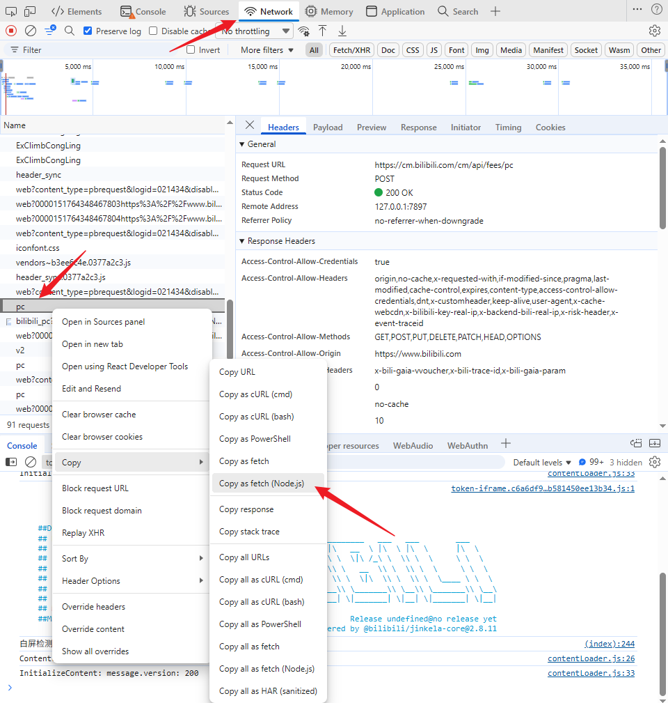

# fetch2requests

把 **Node.js fetch** 代码一键转成 **Python requests** 脚本的小工具。  
支持自动识别 JSON / 表单 / 纯文本 body，处理 cookie、header、method 等全部参数，**跨行 JSON 也能完整解析**。

---

## ✨ 特性

- ✅ 正则提取，无需 Node.js 环境
- ✅ 支持 `JSON.stringify({...})`、模板字符串、转义引号
- ✅ 自动使用 `json=` 或 `data=`，生成可直接运行的 `.py` 文件
- ✅ 批量处理：一次读取整个 `.js` 文件，输出多段 `requests` 代码
- ✅ 单文件脚本，零依赖（仅标准库）

---

## 🚀 快速开始

1. 克隆或下载脚本
   ```bash
   curl -O https://raw.githubusercontent.com/newbieking/fetch_converter/main/convert_nodejs_2_requests.py
   ```

2. 准备一段包含 `fetch(...)` 的 JS 文件，例如 `demo.js`
   ```js
   fetch("https://httpbin.org/post", {
     method: "POST",
     headers: { "Content-Type": "application/json" },
     body: JSON.stringify({ name: "bilibili", age: 14 })
   });
   ```
   我通常在浏览器的开发者工具中，直接copy捕获的数据请求，复制相应的fecth（nodejs版本）来快速生成相应的请求代码：
   例如:
   

3. 运行转换
   ```bash
   python convert_nodejs_2_requests.py demo.js demo.py
   ```

4. 直接执行生成的 Python 文件
   ```bash
   python demo.py
   ```

---

## 📖 命令行用法

```bash
python convert_nodejs_2_requests.py <input.js> [output.py]
```

| 参数          | 说明                         |
|-------------|----------------------------|
| `input.js`  | **必须**，含 `fetch` 调用的 JS 文件 |
| `output.py` | **可选**，不指定时结果打印到终端         |

---

## 🧪 高级示例

输入（`bilibili.post.js`）：

```js
fetch("https://cm.bilibili.com/cm/api/fees/pc", {
    "headers": {"content-type": "application/json", ...},
    "body": "{\"uploads\":[{\"src_id\":5614,\"track_id\":\"\", ...}]}",
    "method": "POST"
});
```

输出（`bilibili_post.py`）：

```python
import requests

url = "https://cm.bilibili.com/cm/api/fees/pc"
headers = {
    "content-type": "application/json",
    ...
}
cookies = {...}
json_data = {"uploads": [{"src_id": 5614, "track_id": "", ...}]}

response = requests.post(url, headers=headers, cookies=cookies, json=json_data)
print(response.status_code)
print(response.text)
```

---

## ⚙️ 脚本核心正则

| 名称           | 用途                            |
|--------------|-------------------------------|
| `FETCH_RE`   | 提取 `fetch(url, { ... })` 整体   |
| `HEADERS_RE` | 提取 `"headers": {...}`         |
| `BODY_RE`    | **升级正则**，支持跨行 JSON、转义引号、模板字符串 |
| `METHOD_RE`  | 提取 `"method": "POST"`         |
| `COOKIE_RE`  | 提取 `"cookie": "a=1; b=2"`     |

---

## 🛠️ 二次开发

脚本纯标准库，无额外依赖。  
主要入口：

```python
def convert_one_fetch(js_code: str) -> str:
    """返回一段可直接运行的 Python 代码"""
```

如需支持 `axios`、`$.ajax` 等，可仿照新增正则分支。

---

## 📄 License

MIT · feel-free to fork & PR